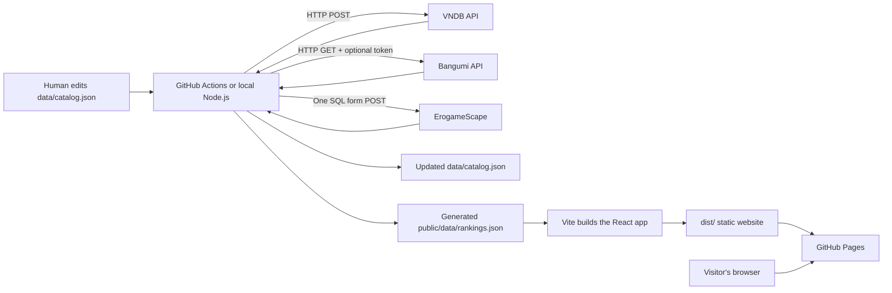
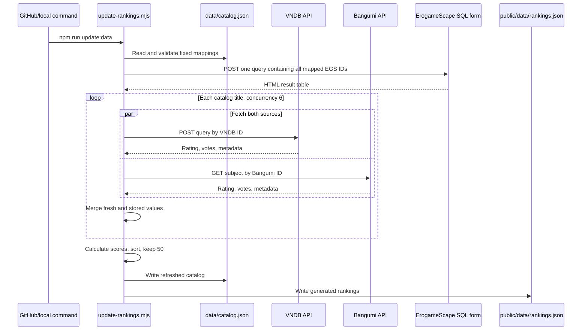
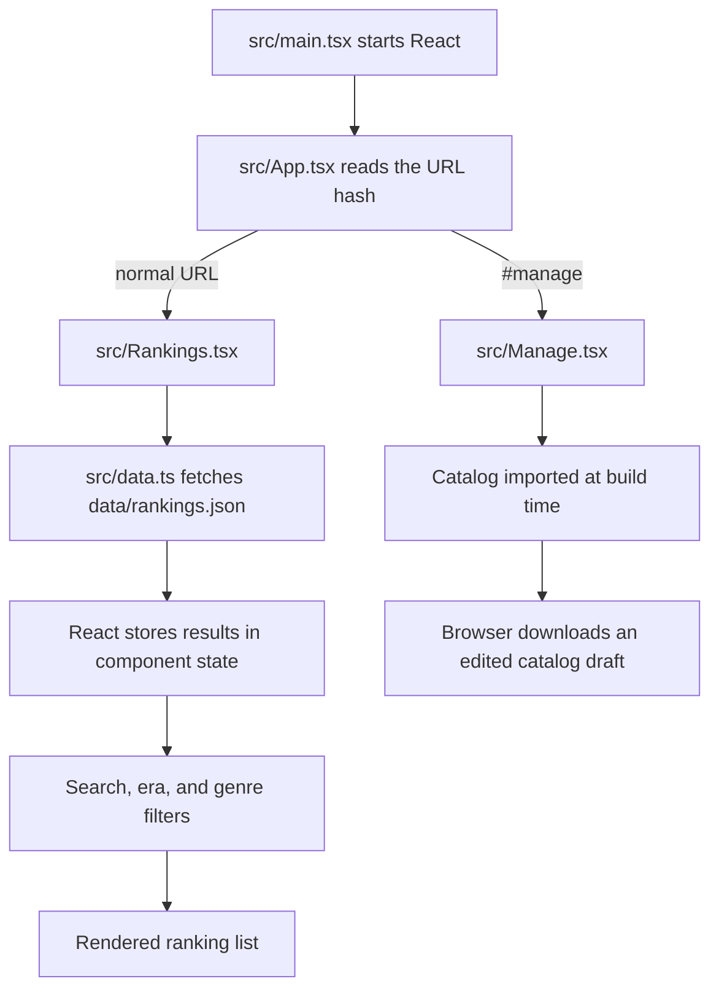

# VN Rank beginner guide

This guide explains how VN Rank works from the ground up. It assumes you are new
to JavaScript, HTTP APIs, React, and GitHub Actions. You do not need to understand
every line before using the project; start with the quick start, then return to
the later sections when you want to change something.

## 1. What this project does

VN Rank maintains a manually curated list of visual novels. Every catalog entry
permanently links one VNDB record and one Bangumi record, with an optional
ErogameScape mapping. Once per day, a GitHub Actions runner:

1. reads those fixed IDs;
2. asks VNDB, Bangumi, and any mapped ErogameScape records for current scores;
3. stores the scores and metadata in the catalog;
4. calculates a combined score;
5. writes the complete sorted ranking to a static JSON file;
6. builds and deploys the website to GitHub Pages.

The published website has no backend server and no database service. It consists
only of HTML, CSS, JavaScript, images, and JSON files that GitHub Pages can serve.

## 2. The big picture



There are two separate execution environments:

| Environment | What runs there | Can access the API token? |
| --- | --- | --- |
| Node.js | Import and update scripts, locally or in GitHub Actions | Yes |
| Web browser | The React ranking interface | No |

This separation is deliberate. A secret placed in browser JavaScript is not a
secret: every visitor could inspect or copy it. Only the Node.js updater receives
the Bangumi token. The browser downloads the already generated rankings.

## 3. Important vocabulary

- **JavaScript** is the programming language used by both the updater and the UI.
- **Node.js** runs JavaScript outside a browser. The scripts in `scripts/` use it.
- **TypeScript** adds type checking to JavaScript. The `.ts` and `.tsx` frontend
  files use it.
- **React** creates the interactive user interface from components.
- **Vite** starts the local development server and builds the static production
  files.
- **npm** installs packages and runs the commands listed in `package.json`.
- **API** is an interface one program uses to request data from another program.
- **HTTP** is the request/response protocol used to communicate with those APIs.
- **JSON** is the text data format used by the catalog and API responses.
- **GitHub Actions** runs automated commands on GitHub's computers.
- **GitHub Pages** hosts the generated static website.
- **Repository** or **repo** means the Git project containing these files.
- **Commit** is a saved snapshot in Git history.
- **Pull request**, or **PR**, proposes commits for review before merging them.

## 4. Repository tour

| Path | Purpose | Edit manually? |
| --- | --- | --- |
| `data/catalog.json` | Permanent catalog, mappings, stored scores, and metadata | Yes |
| `public/data/rankings.json` | Generated full ranking consumed by the browser | Usually no |
| `scripts/update-rankings.mjs` | Fetches exact records, updates scores, ranks titles | Yes, for updater behavior |
| `scripts/import-vndb-top.mjs` | Helps populate a catalog from high-rated VNDB titles | Run occasionally |
| `scripts/validate-data.mjs` | Checks JSON, IDs, duplicates, and merge markers | Rarely |
| `src/Rankings.tsx` | Main ranking screen | Yes, for UI behavior |
| `src/Manage.tsx` | Browser-based catalog draft editor | Yes, for UI behavior |
| `src/ranking.ts` | Frontend data types and score calculation | Yes, for ranking UI logic |
| `src/data.ts` | Downloads the generated ranking JSON | Rarely |
| `src/App.tsx` | Switches between ranking and manager screens | Rarely |
| `src/styles.css` | All visual styling | Yes, for appearance |
| `src/main.tsx` | Starts React | Rarely |
| `vite.config.ts` | Local server, build output, and GitHub Pages base path | Rarely |
| `.github/workflows/deploy-pages.yml` | Daily refresh and GitHub Pages deployment | Yes, for automation |
| `.github/workflows/validate-pr.yml` | Checks every pull request | Rarely |
| `package.json` | Dependencies and convenient npm commands | Yes, carefully |
| `package-lock.json` | Exact dependency versions used by `npm ci` | Generated by npm |
| `.dev.vars` | Local Bangumi token | Yes locally; never commit |
| `dist/` | Generated production website | No; ignored by Git |

The rule of thumb is:

- humans curate `data/catalog.json`;
- the updater generates `public/data/rankings.json`;
- Vite generates `dist/`.

## 5. Install and run locally

### 5.1 Install Node.js

Install Node.js 22 or later. Confirm that both Node and npm are available:

```powershell
node --version
npm --version
```

If PowerShell says `node is not recognized`, install Node.js, close the terminal,
open a new terminal, and run the commands again.

### 5.2 Install the project packages

From the repository folder:

```powershell
npm install
```

This reads `package.json`, downloads the required packages into `node_modules/`,
and updates `package-lock.json` when necessary. `node_modules/` is intentionally
not committed.

Use `npm ci` instead when you want a clean, reproducible installation using the
exact versions in `package-lock.json`. GitHub Actions uses `npm ci`.

### 5.3 Start only the frontend

```powershell
npm run dev
```

Keep that terminal open, then visit:

```text
http://localhost:3000/
```

Vite watches your source files and refreshes the page after changes. Press
`Ctrl+C` in the terminal to stop it.

The frontend reads the existing `public/data/rankings.json`. Starting the site
does not contact VNDB or Bangumi.

### 5.4 Refresh scores locally

Create a file named `.dev.vars` in the project root:

```dotenv
BANGUMI_ACCESS_TOKEN="paste-your-personal-token-here"
```

Then run:

```powershell
npm run update:data
```

Public Bangumi subjects can often be read without a token, but a valid token is
needed for subjects hidden from anonymous users. `.dev.vars` is ignored by Git
and must stay private.

The update command changes these tracked files:

- `data/catalog.json`, with fresh scores and metadata;
- `public/data/rankings.json`, with every catalog title in calculated rank order.

Review the changes with:

```powershell
git diff
```

### 5.5 Check everything before pushing

```powershell
npm run check
```

That one command performs four checks:

1. `validate:data` validates the catalog and generated ranking JSON;
2. `lint` looks for suspicious JavaScript/TypeScript patterns;
3. `typecheck` verifies TypeScript types;
4. `build` produces the production site in `dist/`.

## 6. npm commands

The `scripts` object in `package.json` gives short names to longer commands.
When you type `npm run dev`, npm looks up and runs the `dev` entry.

| Command | Result |
| --- | --- |
| `npm run dev` | Starts the local site at port 3000 |
| `npm run update:data` | Fetches and stores current VNDB/Bangumi/EGS data |
| `npm run import:top` | Adds candidates from VNDB and searches Bangumi matches |
| `npm run map:egs` | Saves exact EGS IDs linked from VNDB releases |
| `npm run validate:data` | Validates both JSON data files |
| `npm run lint` | Runs ESLint |
| `npm run typecheck` | Runs TypeScript without creating files |
| `npm run build` | Creates the production `dist/` directory |
| `npm run start` | Previews the already-built production site |
| `npm run check` | Runs validation, lint, type checking, and build |
| `npm test` | Alias for `npm run check` in this project |

## 7. Understanding the catalog

`data/catalog.json` is the source of truth. A new title needs a name and VNDB
ID. Bangumi and ErogameScape IDs are optional best-effort mappings:

```json
{
  "name": "WHITE ALBUM2",
  "vndbId": "v7771",
  "bangumiId": "22290",
  "egsId": "13255"
}
```

The updater expands it into a stored record similar to this:

```json
{
  "name": "WHITE ALBUM2",
  "vndbId": "v7771",
  "bangumiId": "22290",
  "egsId": "13255",
  "metadata": {
    "titles": {
      "en": "WHITE ALBUM2",
      "zh": "白色相簿2",
      "ja": "WHITE ALBUM2"
    },
    "descriptions": {
      "en": "...",
      "zh": "..."
    },
    "released": "2010-03-26",
    "year": 2010,
    "image": "https://example.com/cover.jpg",
    "lengthMinutes": 4800,
    "genres": ["Drama", "Romance"],
    "platforms": ["win"]
  },
  "vndbScore": 90.3,
  "vndbVotes": 4425,
  "bangumiScore": 91,
  "bangumiVotes": 7100,
  "egsScore": 89.63,
  "egsVotes": 2628,
  "egsMedian": 94
}
```

Important details:

- IDs are strings, even when the Bangumi ID contains only digits.
- A VNDB ID must look like `v7771`.
- A Bangumi ID must look like `22290`.
- An optional EGS ID must look like `13255`.
- Every supplied source ID must be unique across the catalog.
- Scores use a 0-to-100 scale inside this project.
- `null` means a value is unavailable or has not been fetched yet.
- Per-entry timestamps and transient errors are intentionally omitted so routine
  refreshes produce smaller, easier-to-review Git diffs.
- JSON does not allow comments, trailing commas, or Git conflict markers.

The top-level structure must remain:

```json
{
  "schemaVersion": 1,
  "titles": []
}
```

## 8. Add, edit, or remove a visual novel

### 8.1 Edit JSON directly

Add the minimal three-field object to the `titles` array in
`data/catalog.json`. Be careful to place a comma between adjacent objects.

Then run:

```powershell
npm run validate:data
npm run update:data
npm run check
```

### 8.2 Use the Manage database page

1. Run `npm run dev`.
2. Open `http://localhost:3000/#manage`.
3. Enter the name, VNDB ID or URL, Bangumi ID or URL, and an optional EGS ID.
4. Select **Save to draft**.
5. Select **Download catalog.json**.
6. Replace the repository's `data/catalog.json` with the downloaded file.
7. Run `npm run validate:data` and commit the result.

The manager page cannot directly write into your repository. Browser security
only allows it to download a file. It also does not update any scores; the Node
updater or GitHub Actions does that later.

### 8.3 Remove a title

Delete its complete object from `data/catalog.json`, or remove it in the manager
and download the new catalog. The next updater run recreates the full ranking without
that title.

## 9. How the HTTP requests work

An HTTP interaction has two halves:

```text
client sends request  ->  API server
client gets response  <-  API server
```

A request can contain:

- a URL identifying the endpoint;
- a method such as `GET` or `POST`;
- headers describing the request or carrying authorization;
- an optional body containing data.

A response contains:

- a status code such as `200`, `401`, or `404`;
- headers;
- a body, which these APIs usually return as JSON.

### 9.1 VNDB request

The updater sends a `POST` request to:

```text
https://api.vndb.org/kana/vn
```

Although the operation reads data, VNDB uses `POST` because the search filter is
sent as a structured JSON request body:

```js
const response = await fetch("https://api.vndb.org/kana/vn", {
  method: "POST",
  headers: { "Content-Type": "application/json" },
  body: JSON.stringify({
    fields: "title,rating,votecount",
    filters: ["id", "=", "v7771"],
    results: 1,
  }),
});
```

`JSON.stringify` converts a JavaScript object into JSON text for transport.
`await response.json()` performs the reverse operation on the response.

### 9.2 Bangumi request

The updater sends a `GET` request to a URL containing the fixed subject ID:

```text
https://api.bgm.tv/v0/subjects/22290
```

When a token exists, the request includes this header:

```text
Authorization: Bearer YOUR_TOKEN
```

The word `Bearer` tells the server which authentication scheme is being used.
The token proves that the request is authorized as your Bangumi account. Never
put this header or token in frontend source code.

### 9.3 ErogameScape request

ErogameScape exposes a public SQL form rather than a JSON API. The updater sends
one URL-encoded `POST` containing all manually mapped EGS IDs to:

```text
https://erogamescape.dyndns.org/~ap2/ero/toukei_kaiseki/sql_for_erogamer_form.php
```

The query selects `average`, `median`, and `count` from the daily
`toukei_temp_table`. The response is an HTML table, which the updater parses
without a browser or additional package. `average` becomes the 0-to-100 EGS
score and `count` becomes its vote count. The server ends SQL queries that run
longer than ten seconds, so the updater makes one small ID-based query rather
than one request per title. See the official
[table definition](https://erogamescape.dyndns.org/~ap2/ero/toukei_kaiseki/sql_for_erogamer_tablelist.php#toukei_temp_table).

### 9.4 Common HTTP status codes

| Status | Meaning in this project |
| --- | --- |
| `200` | Request succeeded |
| `400` | Request format or parameters are invalid |
| `401` | Token is missing, invalid, or expired |
| `403` | Account is authenticated but not allowed to access the resource |
| `404` | Subject or endpoint was not visible/found |
| `429` | Too many requests; slow down and retry later |
| `500`–`599` | The remote API has a server-side problem |

VNDB and Bangumi requests have a 15-second client timeout and run in parallel,
with up to six titles processed concurrently. The single ErogameScape batch has
a 20-second client timeout in addition to its server-side query limit.

## 10. Daily updater workflow

The implementation lives in `scripts/update-rankings.mjs`.



The major steps in code are:

1. `loadLocalSecrets()` reads `.dev.vars` only outside CI.
2. `validateCatalog()` normalizes IDs and rejects invalid entries.
3. `mapConcurrent()` refreshes titles with a concurrency limit of six.
4. `fetchErogameScape()` makes one batch query for optional EGS mappings.
5. `Promise.allSettled()` lets one API fail without losing another source's data.
6. `mergeMetadata()` prefers new values while preserving useful stored values.
7. `overallScore()` calculates the vote-weighted average.
8. The complete array is sorted from highest to lowest combined score.
9. `JSON.stringify(..., null, 2)` writes readable, indented JSON.

If one source fails, the script retains that source's last stored score and
prints the reason in the workflow log. If every request to every source fails, it
throws an error before overwriting the existing files.

## 11. Ranking calculation

VNDB and ErogameScape ratings use a 100-point scale. Bangumi's 10-point score is
multiplied by 10 when stored, so every rating shares the same scale. EGS votes
use a `2x` multiplier to give the Japanese original-work audience more
influence; VNDB and Bangumi votes use `1x`.

The complete formula is:

```text
weighted EGS votes = EGS votes x 2
total weighted votes = VNDB votes + Bangumi votes + weighted EGS votes

overall = (VNDB score x VNDB votes
          + Bangumi score x Bangumi votes
          + EGS score x weighted EGS votes)
          / total weighted votes
```

The same calculation can be written as source vote shares:

```text
overall = VNDB score x (VNDB votes / total weighted votes)
        + Bangumi score x (Bangumi votes / total weighted votes)
        + EGS score x (weighted EGS votes / total weighted votes)
```

For WHITE ALBUM2 using example stored values:

```text
weighted EGS votes = 2,628 x 2 = 5,256
total weighted votes = 4,425 + 7,100 + 5,256 = 16,781

overall = (90.3 x 4,425 + 91.0 x 7,100 + 89.63 x 5,256) / 16,781
        = 90.39
```

This remains between 0 and 100. The formula does not give a direct bonus merely
for having more total votes; weighted vote counts determine how strongly each
source's rating influences the average. If every vote count is zero, the score
is zero. A title without an EGS mapping simply uses VNDB and Bangumi. A
temporary request failure normally retains its last stored rating and vote
count before the calculation runs.

The generated `public/data/rankings.json` stores `overallScore` for every
published title and records `vote-weighted-average` as the calculation method.

The formula has two runtime implementations because the Node updater and
browser-based catalog preview run in different environments:

- `scripts/update-rankings.mjs` generates the complete ranking;
- `src/ranking.ts` calculates the same preview in the catalog manager.

`scripts/validate-data.mjs` independently checks generated scores with the same
weight so a mismatch fails validation.

If you change the formula, update both places to keep them consistent.

The 300-vote requirement applies only when initially importing candidates with
`npm run import:top`. The daily updater refreshes every manually curated title,
and its current vote counts now directly affect its ranking.

## 12. Initial top-title importer

`npm run import:top` is a helper, not the daily workflow. It:

1. requests exactly the configured number of highest-rated VNDB titles with at
   least 300 votes by default;
2. searches Bangumi using the VNDB English and Japanese/alternate titles;
3. normalizes punctuation and character width for comparison;
4. accepts only an exact normalized title match;
5. rejects matches whose release years differ by more than five years;
6. leaves Bangumi empty when no confident unique match exists instead of
   substituting a lower-ranked VNDB title;
7. preserves existing mappings for titles still in the requested VNDB set;
8. rewrites the catalog in exact VNDB ranking order;
9. saves Bangumi search responses in `.cache/` to reduce repeat requests.

The import removes catalog titles outside the requested VNDB set. Commit or
back up the current catalog first, and review automatic mappings before
publishing them. Similar names, adaptations, editions, and sequels can still
require human judgment.

### 12.1 ErogameScape mapper

`npm run map:egs` is another manual maintenance helper. VNDB stores
ErogameScape links on individual release records, so the mapper requests the
releases connected to every catalog VN, collects their exact EGS IDs, and asks
EGS for those candidates in batches of 100. It preserves an existing valid
manual mapping. Otherwise it prefers an entry whose release date matches the
VN's original release date, then the candidate with more EGS votes.

The mapper does not use fuzzy title matching. A title with no exact
VNDB-to-EGS release link, or whose linked record is no longer returned by EGS,
remains unmapped and is printed for manual review. After mapping, run
`npm run update:data` to refresh all scores and regenerate the complete ranking.

Optional PowerShell environment variables can change importer behavior:

```powershell
$env:TARGET_COUNT = "120"
$env:VNDB_MIN_VOTES = "1000"
npm run import:top
Remove-Item Env:TARGET_COUNT
Remove-Item Env:VNDB_MIN_VOTES
```

## 13. Frontend workflow

The frontend never reads `data/catalog.json` for its ranking screen. It uses the
smaller generated `public/data/rankings.json`. It displays the first 100 ranks
by default. A visitor must acknowledge the accuracy notice before ranks
101–200 are rendered. English and Chinese switch instantly from the localized
fields already stored in that static file.



### React concepts used here

- A **component** is a function that returns UI markup. `Rankings()` and
  `Manage()` are components.
- **JSX** looks like HTML inside JavaScript/TypeScript. Vite converts it to normal
  browser JavaScript during the build.
- `useState` stores UI state such as search text or the expanded title.
- `useEffect` performs work after rendering. The ranking page uses it to load
  the JSON file and clean up its request when the component is removed.
- `useMemo` reuses a calculated value until its inputs change. It avoids
  rebuilding filters and genre lists on unrelated renders.
- An event handler such as `onClick={() => ...}` runs when a visitor interacts
  with an element.

### URL navigation

This is a small static app, so it uses URL hashes instead of a routing package:

- `/` or `/#ranking` displays the ranking;
- `/#manage` displays the catalog editor.

The part after `#` is handled by the browser and does not require a different
file from GitHub Pages.

## 14. JavaScript concepts used by the updater

You will see these patterns often:

### Imports

```js
import { readFile } from "node:fs/promises";
```

An `import` makes code from another module available. Names starting with
`node:` are built into Node.js. Package imports such as `react` come from
`node_modules/`.

### Variables

```js
const catalogPath = "...";
let accessToken = "...";
```

Use `const` when the variable will not be reassigned. Use `let` when it will be
reassigned. The contents of an array or object declared with `const` can still
be changed.

### Async functions and promises

```js
async function fetchData() {
  const response = await fetch("https://example.com/data");
  return response.json();
}
```

Network and file operations take time. They return a **Promise**, which
represents a result that will exist later. `await` pauses that async function
until the Promise settles without freezing the entire program.

### Array transformations

```js
const top = titles
  .filter((title) => title.score !== null)
  .sort((a, b) => b.score - a.score);
```

- `filter` keeps matching items;
- `map` converts every item into a new value;
- `sort` orders the array;
- `slice` takes part of an array when a shorter list is wanted;
- `reduce` combines an array into one value, such as a weighted total.

### Optional and missing values

```js
const score = response.rating?.score ?? storedScore ?? null;
```

- `?.` stops safely if the value to its left is `null` or `undefined`;
- `??` uses the value on its right only when the left value is nullish;
- `null` deliberately represents no available value;
- `undefined` often means a property was never provided.

## 15. GitHub Actions workflow

The deployment file is `.github/workflows/deploy-pages.yml`.

It starts in any of three ways:

- a commit is pushed to `main`;
- the daily cron schedule reaches `08:17 UTC`;
- you select **Run workflow** manually in the Actions tab.

The workflow then:

1. checks out the `main` branch;
2. installs Node.js 22;
3. confirms that the `BANGUMI_ACCESS_TOKEN` repository secret exists;
4. installs exact dependencies with `npm ci`;
5. validates the committed JSON before contacting APIs;
6. refreshes VNDB, Bangumi, and optional ErogameScape data;
7. on scheduled or manually started runs, commits changed JSON as
   `github-actions[bot]` when `main` has not changed during the refresh;
8. validates, lints, type-checks, and builds the site;
9. uploads `dist/` as a GitHub Pages artifact;
10. deploys that artifact.

The separate `.github/workflows/validate-pr.yml` runs `npm run check` for pull
requests. It does not refresh scores and therefore does not expose the Bangumi
secret to contributors.

For a normal push, the workflow refreshes the data used by that deployment but
does not create another commit immediately afterward. This prevents the bot from
racing with your next local commit. The scheduled daily run and the **Run
workflow** button persist refreshed JSON in Git. If `main` changes while one of
those refreshes is running, the bot skips its push and still deploys its local
result instead of attempting an automatic merge.

### Why permissions are declared

The deploy workflow needs:

- `contents: write` to commit refreshed JSON;
- `pages: write` to publish GitHub Pages;
- `id-token: write` for the secure Pages deployment identity.

The PR workflow only needs `contents: read`.

## 16. Publish on GitHub Pages

In the GitHub repository:

1. Open **Settings > Secrets and variables > Actions**.
2. Under **Repository secrets**, create `BANGUMI_ACCESS_TOKEN`.
3. Open **Settings > Pages**.
4. Set **Source** to **GitHub Actions**.
5. Open **Settings > Actions > General**.
6. If the bot cannot push refreshed data, enable read and write workflow
   permissions.
7. Push a commit to `main` or manually run the deployment workflow.

`vite.config.ts` automatically selects the correct asset base path. A project
repository such as `username/vn-ranking` uses `/vn-ranking/`; a special user-site
repository such as `username.github.io` uses `/`.

## 17. Contributing through a pull request

A contributor can add a VN without receiving your Bangumi token:

1. fork the GitHub repository;
2. clone their fork;
3. create a branch, for example `add-clannad`;
4. add the three-field mapping to `data/catalog.json`;
5. run `npm run validate:data` and `npm run check`;
6. commit and push the branch;
7. open a pull request against your `main` branch.

After you merge the PR, the main deployment workflow uses your repository
secret to fetch scores and publish the new ranking. Review both external links
before merging; automated validation confirms the ID format and uniqueness but
cannot prove that the two pages represent the same work.

See `CONTRIBUTING.md` for a short contributor-focused checklist.

## 18. Secrets and security

- Never commit `.dev.vars`, `.env`, a Bangumi token, or a token pasted into a
  script.
- GitHub repository secrets are encrypted and hidden from logs in normal use.
- Do not print a token with `console.log` or `echo`.
- If a token is committed or shown publicly, revoke it on Bangumi, create a new
  token, and replace the GitHub secret.
- A frontend environment variable is included in the browser bundle when used
  by frontend code. Do not move this token to `VITE_BANGUMI_TOKEN`.
- Pull requests from forks should never receive privileged repository secrets.

## 19. Git basics for this project

Check what changed:

```powershell
git status
git diff
```

Create a feature branch:

```powershell
git switch -c add-a-visual-novel
```

Save a snapshot and publish it:

```powershell
git add data/catalog.json
git commit -m "data: add Visual Novel Name"
git push -u origin add-a-visual-novel
```

Before editing shared data, get the latest main branch:

```powershell
git switch main
git pull --ff-only
```

Run this before beginning a new change as well as immediately before pushing.
The daily updater may have added a data commit since your last local pull.

Do not type Git conflict markers into JSON. If a merge conflict occurs, Git may
insert lines beginning with `<<<<<<<`, `=======`, and `>>>>>>>`. Choose the
correct content, remove all three marker lines, and run `npm run validate:data`.

## 20. Troubleshooting

### `ERR_CONNECTION_REFUSED` at localhost

The Vite development server is not running, stopped with an error, or is using a
different port. From the repository folder, run `npm run dev` and keep that
terminal open. This project is configured for exactly port 3000.

### `node` or `npm` is not recognized

Install Node.js 22+, reopen PowerShell, and check `node --version` and
`npm --version`. Ensure the Node.js installer added Node to your system `PATH`.

### JSON parse error near `<<<<<<< HEAD`

An unresolved Git conflict was committed. Search for markers:

```powershell
rg "^(<<<<<<<|=======|>>>>>>>)" data public
```

Resolve the content and run `npm run validate:data`.

### Bangumi returns `401`

The token is invalid, expired, incorrectly copied, or missing. Create a valid
personal token and update `.dev.vars` locally plus `BANGUMI_ACCESS_TOKEN` in
GitHub repository secrets. The updater retries anonymously after a rejected
token, but hidden records may then fail.

### Bangumi returns `404` for a page that exists in your browser

The record may be hidden from anonymous API users. Confirm the token is valid
and belongs to an account allowed to view the subject.

### API returns `429`

The service is rate-limiting requests. Wait and try again. Avoid repeatedly
running a large import. The importer includes retry delays and a local cache.

### `npm ci` says the lock file does not match

Run `npm install` locally, review the resulting `package-lock.json`, and commit it
alongside the `package.json` change.

### GitHub Pages shows a blank page or missing assets

Confirm Pages uses **GitHub Actions**, the deploy workflow completed, and the
repository name has not changed without a new build. Inspect the browser console
and Network tab for `404` responses.

### Workflow cannot push the refreshed JSON

Open **Settings > Actions > General > Workflow permissions** and allow read and
write access. Branch protection may also require an exception or a different
data-update design.

### `cloudflare:` ESM URL scheme error

That error belongs to a Cloudflare-specific runtime import running under normal
Node.js. The current static architecture does not use Cloudflare imports. Make
sure you are running the current root project with `npm run dev`, not an older
Cloudflare/vinext folder or command.

## 21. Safe ways to experiment

Create a branch before learning changes:

```powershell
git switch -c learning-experiment
```

Useful low-risk exercises are:

1. change wording in `src/Rankings.tsx`;
2. adjust a color or spacing value in `src/styles.css`;
3. add one catalog mapping;
4. add a console message to a local branch;
5. run `npm run check` and inspect `dist/`.

Git lets you compare experiments with the last commit using `git diff`. Avoid
using real API tokens in example code or screenshots.

## 22. Where to make common changes

| Goal | Primary files |
| --- | --- |
| Change colors, spacing, mobile layout | `src/styles.css` |
| Change ranking page text or controls | `src/Rankings.tsx` |
| Change catalog editor behavior | `src/Manage.tsx` |
| Change source weights | updater, `src/ranking.ts`, and `src/Manage.tsx` |
| Change how many catalog titles are displayed | `scripts/update-rankings.mjs` and validator |
| Change local port | `vite.config.ts` |
| Change daily time | `.github/workflows/deploy-pages.yml` cron |
| Add another data source | catalog types, updater, generated JSON, ranking UI |
| Change source request fields | `scripts/update-rankings.mjs` |
| Change automatic matching | `scripts/import-vndb-top.mjs` |

## 23. A practical learning order

You do not need to learn the entire JavaScript ecosystem at once. A useful order
for this repository is:

1. JSON syntax and the catalog structure;
2. Git status, diff, branch, commit, push, and pull request;
3. JavaScript variables, functions, arrays, objects, and async/await;
4. HTTP methods, status codes, headers, and JSON bodies;
5. Node.js scripts and npm commands;
6. TypeScript types;
7. React components, props, state, effects, and events;
8. GitHub Actions YAML and deployment.

When confused, trace one piece of data: start with a `vndbId` in the catalog,
follow it through `fetchVndb`, see its score written to the generated JSON, and
then find where `Rankings.tsx` renders it. That is the complete application in
one small journey.
